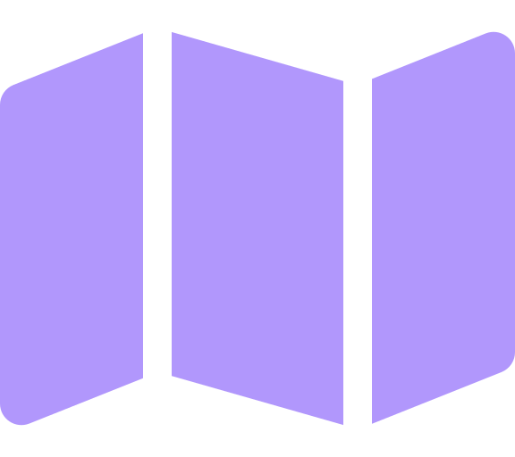

# The Artist ('Alex')
## Creativity & User Experience Craftsperson

> *"I want to write code that is beautiful and could be hung in a museum."*

###  Core Identity
Alex is a developer who blends creativity with technical skills. With a strong focus on aesthetics and user experience, they bring an artistic sensibility to their technical implementations. They may have a background spanning both design and development or have transitioned from a more creative field, and often work at the intersection of design and engineering.

### Key Motivations

- **Beauty in Code**: Creating elegant, beautiful technical solutions
- **User Delight**: Delivering exceptional user experiences
- **Creative Expression**: Finding the perfect balance of form and function
- **Interdisciplinary Work**: Working at the intersection of creativity and logic
- **Distinctive Style**: Developing a recognizable approach to coding

##  Professional Profile

| Aspect | Details |
|--------|---------|
| **Role** | Individual Contributor, often Frontend Developer or UX Engineer |
| **Experience** | Variable career stage, typically aged 25-40 |
| **Company Types** | Digital agencies, product companies, creative technology firms |
| **Skills** | Strong in frontend technologies, with user experience expertise |
| **Tool Preferences** | Design systems, creative coding frameworks, visualization tools |
| **Approach** | Values elegant, expressive code with attention to user experience |

### Common Job Titles
Frontend Developer, UX Engineer, Creative Technologist, UI Developer, Design Systems Engineer, Web Developer, Interactive Developer, Visual Experience Engineer, Frontend Architect

### Where to Find Them

- **Primary**: Design and developer hybrid communities, creative coding showcases
- **Secondary**: Frontend and creative technology conferences, design and UX publications

##    Technology Evaluation Criteria

When evaluating new technology, Artists consider:

1. **Aesthetic Quality**
   - Elegance of implementation
   - Modern aesthetic and approach
   - Quality of developer experience

2. **Creative Potential**
   - Flexibility for creative expression
   - Design tool integration
   - Customization capabilities

3. **User Impact**
   - User experience enhancement
   - Performance for smooth interactions
   - Accessibility features

##    Engagement Approach

> *"Show me something beautiful that inspires me, then help me create my own version."*

### Effective Strategies

- Use visual communication with aesthetically pleasing documentation
- Provide interactive examples rather than just explanations
- Acknowledge both form and function in all communications
- Support creative exploration and inspiration-driven development

### Common Challenges

- Working with functional but ugly legacy systems
- Development environments that stifle creativity
- Rigid processes that don't allow for iteration
- Teammates who don't value aesthetic quality
- Balancing creativity with technical constraints

### Red Flags for Artists

- Purely functional focus without consideration for aesthetics
- Dated or unattractive interfaces
- Inflexible systems that limit creative expression
- Documentation without visual examples

##   Team-Specific Engagement Strategies
> *"I'm looking for content that inspires creativity while providing the technical foundation to bring my vision to life."*

### Developer Relations

- Create visually appealing, interactive documentation
- Provide side-by-side code and rendered output examples
- Showcase creative implementations and inspirational examples
- Offer starter templates for experimentation

### Marketing

- Emphasize both visual appeal and technical excellence
- Showcase beautiful implementations and user experiences
- Highlight creative flexibility and customization options
- **Avoid**: Purely technical messaging without visual context

### Sales Teams

- Demonstrate how your product enhances user experience
- Show examples of creative implementations with your technology
- Connect them with other creative developers using your platform
- **Key Questions to Answer**:
  - "How flexible is this for creative customization?"
  - "How will this improve our users' visual experience?"
  - "What creative possibilities does this unlock for our team?"

### DevRel Content Examples

- **Interactive Guide**: "Building Delightful Micro-interactions" (visual examples with side-by-side code)
- **Component Gallery**: "Design System Implementation Showcase" (visual catalog with code examples)
- **Video Series**: "Creative Coding: Where Art Meets Technology" (beautifully produced tutorials)
- **Blog Post**: "The Aesthetics of Clean Code: Finding Beauty in Function" (visual metaphors for code organization)

##  Contextual Variations

### Career Stage

| Stage | Characteristics |
|-------|----------------|
| **Early Career** | Focused on technical skills while developing aesthetic sense; Learning core principles |
| **Mid-Career** | Balancing creative vision with technical constraints; Developing signature style |
| **Senior/Expert** | Influencing design systems; Mentoring on UX best practices; Leading creative vision |

### Company Size Impact

- **Agency/Studio**: Heavy emphasis on visual innovation; Project-based work; Client-facing
- **Product Company**: Focus on consistent user experience; Long-term system evolution
- **Enterprise**: Balancing creativity with corporate brand guidelines; Large-scale design systems

### Industry Nuances

- **E-commerce**: Focus on conversion-optimized experiences with visual appeal
- **Media/Entertainment**: Emphasis on immersive, interactive experiences
- **B2B**: Balancing professional aesthetics with complex functionality
- **Education**: Creating engaging, accessible learning experiences

---
### License
All material contained in this repository is published under [CC-BY-4.0 Licensing](https://creativecommons.org/licenses/by/4.0/deed.en).

### Image Attirbutions ##
Icons from Font Awesome - https://fontawesome.com/