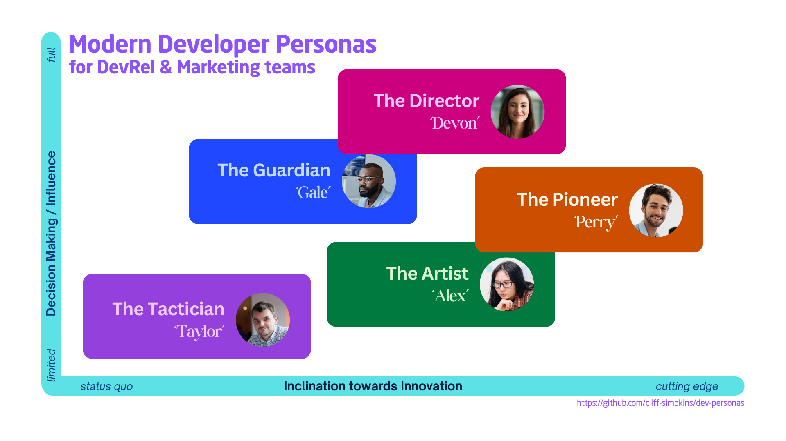
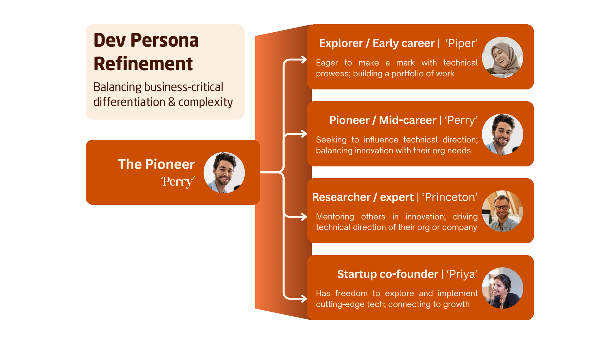

# Modern Developer Personas
This repository contains a collection of developer personas for use by developer marketing and DevRel teams, regardless of the company that they work at and portion of the global developer population that they target. They serve as 'short hand' to help organizations drive clarity of strategy and execution - breaking the large 'developer' population into distinct/named groups that can be prioritized and built for.

These personas are motivation-centric personas, prioritizing behaviors and motivations over job title or ecosystem-preference. The best way to think of how they differ is to place them along two axis - their inclination towards innovation (are they tech-led or solution-led) and how much decision making power do they have. They are also easy to extend and tailor to your particular organization's needs.

These developer personas have been crafted to help your teams...

- Align leadership and internal stakeholders teams on which developer segment you are building for, and what success measures each team is accountable for
- Align with Product and Product Marketing on value proposition, messaging, and GTM planning
- Align with Marketing Operations and Demand Gen to ensure developers are properly identified and treated appropriately
- Align with Sales to ensure developers are authentically engaged

Each persona includes standard dimensions such as motivations, technical profiling (and common job titles), common evaluation criteria, preferences, challenges, communication preferences, and learning styles to enable consistent application across organizations. To put them into action, I recommend [Developer Relations by Caroline Lewko and James Parton](https://www.goodreads.com/book/show/58153391-developer-relations), which demonstrates how to map it to a persona to your developer journey *(Discover -> Evaluate -> Learn -> Build -> Scale)*.

## Five Personas and How to Reach Them
Each persona represents a type of developer you may engage. Below is an example of how a company team may engage a persona - how they measure successful engagement and what they do to engage them.
<table>
  <tr style="background-color:cc007e">
    <td width=400px>
      <a href="Personas/Director.md" style="color:ffc2e8; font-variant:small-caps; font-weight:bold; font-size:140%; text-shadow: 3px 3px 3px #444444">The Director ('Devon')</a>
      
<i>Leadership-focused developer who make strategic decisions.</i>

      
They balance technical expertise with business acumen, focusing on how technology decisions impact organizational goals and team effectiveness.

    </td>
    <td>
      <ul>
        <li><i>Success:</i> Enterprise adoption; Customer satisfaction
        <li><i>Events:</i> Leadership panels; ROI workshops; Strategy
        <li><i>Community:</i> Advisory boards
        <li><i>Feedback:</i> Strategic; Enterprise
        <li><i>Content:</i> Case Studies; Migration Guides; Architecture
      </ul>
    </td>
  </tr>
  <tr style="background-color:cc4e00">
    <td>
      <a href="Personas/Pioneer.md" style="color:fff5e9; font-variant:small-caps; font-weight:bold; font-size:140%; text-shadow: 3px 3px 3px #444444">The Pioneer ('Perry')</a>
      
<i>Developer who thrives on discovering and implementing cutting-edge technologies.</i>

      
They're early adopters who value innovation and are often influential in setting technical direction within their organizations.

    </td>
    <td>
      <ul>
        <li><i>Success:</i> Early adopters; Community content
        <li><i>Events:</i> Hackathons; Emerging tech showcases
        <li><i>Community:</i> Early adoption; Tech previews; Incubators
        <li><i>Feedback:</i> API design; Extensibility
        <li><i>Content:</i> Tech deep dives; API explorations
      </ul>
    </td>
  </tr>
  <tr style="background-color:1f48ff">
    <td>
      <a href="Personas/Guardian.md" style="color:c2dcff; font-variant:small-caps; font-weight:bold; font-size:140%; text-shadow: 3px 3px 3px #444444">The Guardian ('Gale')</a>
      
<i>Developers who prioritize technical excellence and require proven solutions over shiny advances.</i>

      
They value well-engineered solutions, deep understanding of their tools, and the elegance of their implementations.

    </td>
    <td>
      <ul>
        <li><i>Success:</i> Feedback quality; API growth; Case studies
        <li><i>Events:</i> Expert sessions; Arch reviews; workshops
        <li><i>Community:</i> Expert exchange; Tech forums
        <li><i>Feedback:</i> Best practices; Performance; Scalability
        <li><i>Content:</i> Architecture patterns; Tech Reference
      </ul>
    </td>
  </tr>
  <tr style="background-color:007a3f">
    <td>
      <a href="Personas/Artist.md" style="color:d9f4cd; font-variant:small-caps; font-weight:bold; font-size:140%; text-shadow: 3px 3px 3px #444444">The Artist ('Alex')</a>
      
<i>Developers who bring a creative passion into their technical skills.</i>

      
They prioritize the aesthetics and user experience of their work, bringing an artistic sensibility to their technical implementations.

    </td>
    <td>
      <ul>
        <li><i>Success:</i> UX satisfaction; UI showcase/stories
        <li><i>Events:</i> Design workshops; UX labs
        <li><i>Community:</i> Creative exchanges; design communities
        <li><i>Feedback:</i> User experience; visual design
        <li><i>Content:</i> Tutorials; 
      </ul>
    </td>
  </tr>
  <tr style="background-color:9440dd">
    <td>
      <a href="Personas/Tactician.md" style="color:edcbf6; font-variant:small-caps; font-weight:bold; font-size:140%;text-shadow: 3px 3px 3px #444444">The Tactication ('Taylor')</a>
      
<i>Developers who focus on implementation and delivery - delivering to spec.</i>

      
They value clarity, structure, and predictability, focusing on meeting requirements and deadlines consistently.

    </td>
    <td>
      <ul>
        <li><i>Success:</i> Implementation success; Ticket reduction
        <li><i>Events:</i> Hands-on labs; certification prep
        <li><i>Community:</i> Forums; Help centers
        <li><i>Feedback:</i> Doc quality; implementation; Common bugs
        <li><i>Content:</i> Quick starts; code samples; implementation guides
      </ul>
    </td>
  </tr>
</table>

## Persona Design Considerations

### Cross-organization collaboration
Although built with the DevRel and developer marketing teams in mind, the personas are designed to be usable by stakeholder/partner teams - marketing, product, and field/sales. Each personas includes a professional profile section to aid with identification and measurement, as well as an 'engagement tactics by team' section that provides actionable guidance to DevRel stakeholders.

### Persona customization and expansion
By using broad motivations to create each persona, each is easy to tailor and expand to the needs of your organization.

For example, let's say that you are selling an innovative SaaS offering to developers and that builders using your cutting-edge platform ('Perry' persona) is your ideal customer profile (ICP). However, this persona feels to broad to be actionable to your PLG and Sales teams. To do this, you will want to expand the 'Perry' persona to fit the sub-personas you are targeting.

In this example, we created three additional 'Perry' variants and retained 'Perry' as our core/mid-career target:
- 'Piper' is an early in career professional looking to make their mark in an existing SaaS company
- 'Princeton' is the senior research engineer in the innovation / R&D department of enterprises
- 'Priya' is a startup co-founder or lead developer that isn't encumbered by existing infrastructure

For each of the variants above, they each retain the same core identity and motivations of 'Perry', but each has expanded and detailed information about where your company can find them and engage them. To signal the mapping of the variants back to the base/core persona, each name retains the same first letter of the name ('P'), allowing you to provide the additional persona detail without having to add linear cognitive load to users of your personas. Your UX team, for example, can still easily understand how to design dashboards for 'Devon, the Director' (who many want analytics and account info), 'Gale, the Guardian' (who may not want all the bells and whistles), and these personas. And your Marketing team can focus on the broad differentiation between Devon, Gale, and Perry for your broad messaging and website, while tailoring innovation-led marketing campaigns to Piper (e.g., MLH hackathons) or Priya (e.g., Startup Mixer at Seattle Tech Week).

### Guiding principles for persona design

As these personas were built, I used the [DevRel Foundation working group requirements and use case list](https://github.com/DevRel-Foundation/wg-resource-aggregation/discussions/46), which carried the following requirements:
1. Outcome-focused - They can be used to inform and guide DevRel strategies and tactics
2. Motivations - They include both technical and emotional aspects of developers
3. Practical - They incorporate industry-standard dimensions for practical use
4. Use cases - Each persona can drive content creation, event planning, community building, and product feedback
5. FLEXIBLE - They remain flexible enough to be adapted for specific contexts

### Historical roots for these personas

The personas have their root in my experience as a Product Manager at Microsoft - I've been working with personas for 15+ years, designing personas for Windows and Microsoft Azure and working with the UX team that managed personas for all of Microsoft's developer offerings. I could write a book on the lessons learned from Microsoft's decades of persona experience - learning more about differences of segments vs personas, too many vs too few, the importance of regional tailoring, and more (and - in fact - I wrote [a chapter on the topic of personas](https://www.goodreads.com/book/show/49385943-developer-marketing-and-relations)  :) ). 

These particular personas have their roots in an effort in 2017 to create base personas that are industry-wide, not just focused on one product/business. In 2019, my team built and tested a series of Cloud Developer personas (Conductor, Craftsman, Explorer, Artist, and Tactician) that we used with GTM strategy and content creation/testing. I even collaborated with several other platform providers on the idea of open-sourcing them. But the Pandemic came in and put this on the back-burner and I changed companies. The personas in this repository reflect a further evolution of those five, further expanding them and incorporating persona needs I felt running a DevRel team a SaaS provider.

---
### Licensing and Attribution
The personas in this repository are published under [CC-BY-4.0 Licensing](https://creativecommons.org/licenses/by/4.0/deed.en).

Images in this repository may be subject to additional licensing restrictions. 
- Images using photos were created in Canva.com using licensed stock photography
- Icons are from Font Awesome - https://fontawesome.com/ 